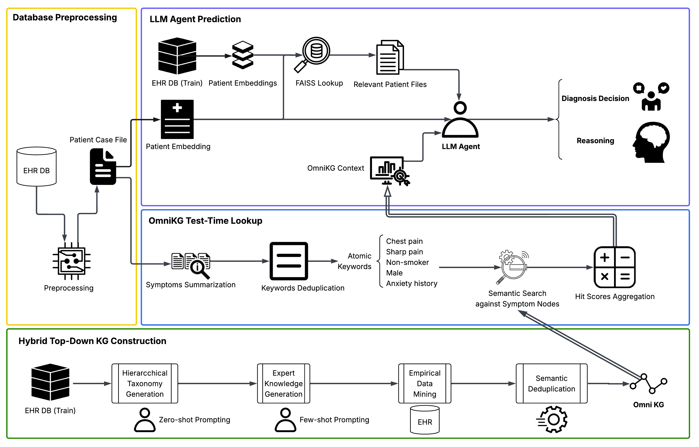

# MedRAG: Medical Retrieval-Augmented Generation

A medical diagnosis system that combines Retrieval-Augmented Generation (RAG) with Knowledge Graph (KG) reasoning to provide accurate medical diagnoses.

## Table of Contents

- [Overview](#overview)
- [Prerequisites](#prerequisites)
- [Setup](#setup)
  - [1. Get the Datasets](#1-get-the-datasets)
  - [2. Setup Conda Environment](#2-setup-conda-environment)
  - [3. Configure API Keys](#3-configure-api-keys)
  - [4. Preprocess Data](#4-preprocess-data)
- [Usage](#usage)
  - [Run MedRAG on DDXPlus](#run-medrag-on-ddxplus)
  - [Run Ablation Studies](#run-ablation-studies)
  - [Evaluate Responses](#evaluate-responses)
  - [Analyze Results](#analyze-results)
- [Project Structure](#project-structure)
- [Troubleshooting](#troubleshooting)

## Overview

MedRAG is a medical diagnosis system that:
- Retrieves similar patient cases using semantic embeddings
- Leverages a medical knowledge graph for structured reasoning
- Generates comprehensive diagnostic reports using LLMs




This project supports the DDXPlus dataset for differential diagnosis tasks.

## Prerequisites

- Python 3.8+
- Conda (recommended) or pip
- OpenAI API key (for GPT models) or Google API key (for Gemini)
- Hugging Face token (for local LLM models)
- ~20 GB disk space for datasets and embeddings
- CUDA-capable GPU (recommended for local LLM inference)

## Setup

### 1. Get the Datasets

#### DDXPlus Dataset

1. Download the DDXPlus dataset from the official source
2. Extract it to the project root directory:
   ```bash
   # Your directory structure should look like:
   MedRAG/
   └── DDXPlus/
       ├── release_train_patients.csv
       ├── release_validate_patients.csv
       ├── release_test_patients.csv
       ├── release_evidences.json
       └── release_conditions.json
   ```

#### Symptom-to-Diagnosis Dataset (Optional)

If you want to use the symptom-to-diagnosis dataset:
```bash
# Download from Hugging Face datasets
python download_s2d.py
```

### 2. Setup Conda Environment

Create and activate a conda environment:

```bash
# Create conda environment
conda create -n medrag python=3.9 -y
conda activate medrag

# Install dependencies
pip install -r requirements.txt

# Download spaCy model (required for text processing)
python -m spacy download en_core_web_sm
```

### 3. Configure API Keys

Edit `authentication.py` and add your API keys:

```python
# OpenAI API key (for GPT models)
api_key = "sk-your-openai-api-key-here"

# Hugging Face token (for local LLM models)
hf_token = "hf-your-huggingface-token-here"

# Google API key (for Gemini models)
google_api_key = "your-google-api-key-here"
```

**Important:** Never commit `authentication.py` with real API keys. It should be in `.gitignore`.

### 4. Preprocess Data

#### Preprocess DDXPlus Dataset

Convert DDXPlus CSV files into MedRAG format:

```bash
# Process all splits (train, val, test)
python preprocess_ddxplus.py

# Or limit the number of samples for testing
python preprocess_ddxplus.py --max_samples 100
```

This will create:
- Individual JSON patient files in `dataset/df/train/`, `dataset/df/val/`, and `dataset/df/test/`
- Ground truth CSV files: `dataset/AI_Data_Set_with_Categories_{split}.csv`

**Note:** Full preprocessing may take 10-30 minutes and creates ~1.3 million JSON files.

#### Preprocess Symptom-to-Diagnosis Dataset (Optional)

If using the symptom-to-diagnosis dataset:

```bash
# Filter specific diagnoses
python download_s2d.py

# Convert to JSON format
python convert_csv_to_json.py
```

## Usage

### Run MedRAG on DDXPlus

Run the full MedRAG pipeline on DDXPlus dataset:

```bash
# Quick test (10 samples, ~2-5 minutes)
python run_ddxplus.py --split test --max_samples 10

# Medium test (100 samples, ~20-50 minutes)
python run_ddxplus.py --split test --max_samples 100

# Full test set (134K samples, 10-20+ hours)
python run_ddxplus.py --split test
```

#### Command-line Arguments

- `--split`: Dataset split to use (`train`, `val`, or `test`) - default: `test`
- `--model`: LLM model to use - default: `local/llama-3.1-8b`
  - Local models: `local/llama-3.1-8b`, `local/llama-3.2-3b`, `local/openbiollm-8b`
  - OpenAI models: `gpt-4o`, `gpt-4o-mini`, `gpt-3.5-turbo-0125`
- `--topk`: Number of similar patients to retrieve (default: `1`)
- `--topn`: Top N categories to consider (default: `1`)
- `--matchn`: Number of matches for KG traversal (default: `5`)
- `--max-samples`: Maximum number of samples to process (default: all)
- `--kg-path`: Path to knowledge graph file (default: `./dataset/llm_kg/knowledge_graph_DDXPlus_LLM.xlsx`)

#### Example Commands

```bash
# Test with different retrieval settings
python run_ddxplus.py --split test --topk 3 --topn 2 --matchn 10 --max_samples 50

# Use a different model
python run_ddxplus.py --split val --model gpt-4o-mini --max_samples 100

# Full evaluation on test set
python run_ddxplus.py --split test --topk 1 --topn 1 --matchn 5
```

Results are saved to `results/{split}/{timestamp}/results_{split}_{model}_topk{topk}_topn{topn}_matchn{matchn}.csv`

### Run Ablation Studies

Run ablation studies to evaluate different components (baseline, RAG-only, KG-only, full):

```bash
# Baseline (no RAG, no KG)
python run_ablation.py --split test --mode baseline --max_samples 100

# RAG only (without KG)
python run_ablation.py --split test --mode rag_only --topk 1 --max_samples 100

# KG only (without RAG)
python run_ablation.py --split test --mode kg_only --max_samples 100

# Full MedRAG (RAG + KG)
python run_ablation.py --split test --mode full --topk 1 --max_samples 100
```

#### Ablation Study Arguments

- `--split`: Dataset split (`train`, `val`, `test`, or `s_to_d`)
- `--mode`: Ablation mode
  - `baseline`: No RAG, no KG
  - `rag_only`: RAG without KG
  - `kg_only`: KG without RAG
  - `full`: Full MedRAG (RAG + KG)
- `--model`: LLM model (default: `local/llama-3.1-8b`)
- `--topk`: Number of documents to retrieve (required for `rag_only` and `full`)
- `--max-samples`: Maximum number of samples
- `--kg-path`: Path to knowledge graph

Results are saved to `results/{split}/{mode}/{timestamp}/`

### Evaluate Responses

Evaluate generated reports using Gemini 2.0 Flash for quality scoring:

```bash
# Evaluate results from a CSV file
python evaluate_responses.py results/test/20241129-120000/results_test_local_llama-3.1-8b_topk1_topn1_matchn5.csv

# Evaluate with custom output path
python evaluate_responses.py results.csv --output evaluations.csv

# Limit number of samples for testing
python evaluate_responses.py results.csv --max-samples 10
```

#### Evaluation Output

The script generates:
- **CSV file** with scores and reasoning for each response
- **Summary JSON** with aggregated statistics

Each evaluation includes:
- **Score**: 1-10 rating for the generated report
- **Reasoning**: Brief explanation of the score
- **Score RAG**: 1-10 rating for RAG retrieval quality
- **Reasoning RAG**: Explanation for RAG score

### Analyze Results

Analyze accuracy and performance metrics:

```bash
# Analyze a single results file
python analyze_results.py results/test/20241129-120000/results_test_local_llama-3.1-8b_topk1_topn1_matchn5.csv

# Analyze all results in a directory
python analyze_results.py results/test/20241129-120000/

# Compare multiple result files
python analyze_results.py results1.csv results2.csv results3.csv

# Compare mode (explicit)
python analyze_results.py results/test/20241129-120000/ --compare
```

#### Analysis Output

The analysis script provides:
- **Top-1 Accuracy**: Exact match accuracy
- **Flexible Accuracy**: Accuracy with variations and aliases
- **Level 1/2 Accuracy**: Category-level accuracy
- **Per-disease Performance**: Accuracy breakdown by disease
- **Confusion Analysis**: Most common misclassifications
- **Dataset Statistics**: Success rates and missing predictions

## Project Structure

```
OmniRAG/
├── dataset/                          # Processed data
│   ├── llm_kg_v2/
│   │   └── knowledge_graph_DDXPlus_LLM_v2.xlsx # OmniKG
│   └── medrag_kg_ddxplus.xlsx    # Baseline KG
├── results/                          # Experiment results
│   └── {split}/{timestamp}/         # Results organized by split and timestamp
├── main_MedRAG.py                   # Core MedRAG functions
├── run_ddxplus.py                   # Main script to run MedRAG on DDXPlus
├── run_ablation.py                  # Ablation study script
├── preprocess_ddxplus.py            # DDXPlus preprocessing script
├── evaluate_responses.py            # Response evaluation script
├── analyze_results.py               # Results analysis script
├── authentication.py                # API keys configuration
├── requirements.txt                 # Python dependencies
└── README.md                        # This file
```
## Quick Reference

```bash
# 1. Setup
conda create -n medrag python=3.9 -y
conda activate medrag
pip install -r requirements.txt

# 2. Preprocess
python preprocess_ddxplus.py

# 3. Run MedRAG
python run_ddxplus.py --split test --max_samples 10

# 4. Run Ablation
python run_ablation.py --split test --mode full --max_samples 10

# 5. Evaluate
python evaluate_responses.py results/test/*/results_*.csv

# 6. Analyze
python analyze_results.py results/test/*/results_*.csv
```

## License

See LICENSE file for details.